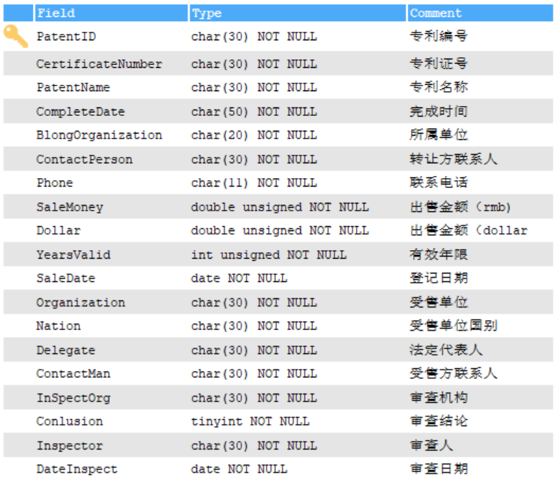

# PatentSale_Info
An IS for classwork, using **mysql + jsp + servlet**.  
As a green hand, it's my first IS project to do all the work **without using any frame**. Though it's a hard work and seems fool by type **each letter** on hand, I've indeed learned a lot from this.   
Looking forward to any issues or PR  
Thanks for my teachers, especially RBg, **Mr.yu**, who guided me for **at least two hours**. 

## Introduction

Patent transfer registration form, used to register information related to the transfer of results. Involving the information of both parties to the transfer, contract information, patent information, sales amount, validity period, review conclusion, etc.  
  
**env:**
- Mysql Ver 8.0.31 for Win64 on x86_64 (MySQL Community Server - GPL)  
- java version "11.0.15.1" 2022-04-22 LTS  
  Java(TM) SE Runtime Environment 18.9 (build 11.0.15.1+2-LTS-10)  
  Java HotSpot(TM) 64-Bit Server VM 18.9 (build 11.0.15.1+2-LTS-10, mixed mode)    
- apache-tomcat-9.0.27
- IntelliJ IDEA 2023.2.2 (Ultimate Edition)

**structure:**

## To Start With
1. create a datebase  
2. create two tables like this(specific sql can be seen in later commit):

  

3. open with idea  
4. configure tomcat
5. run
6. find bugs and advice to improve